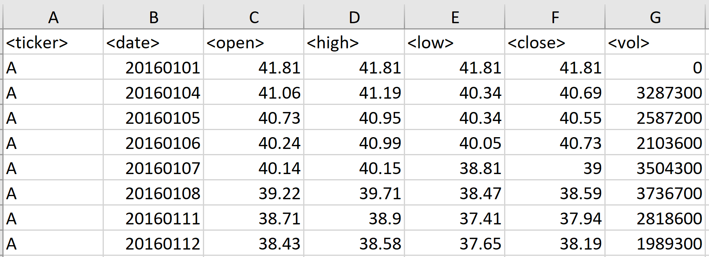
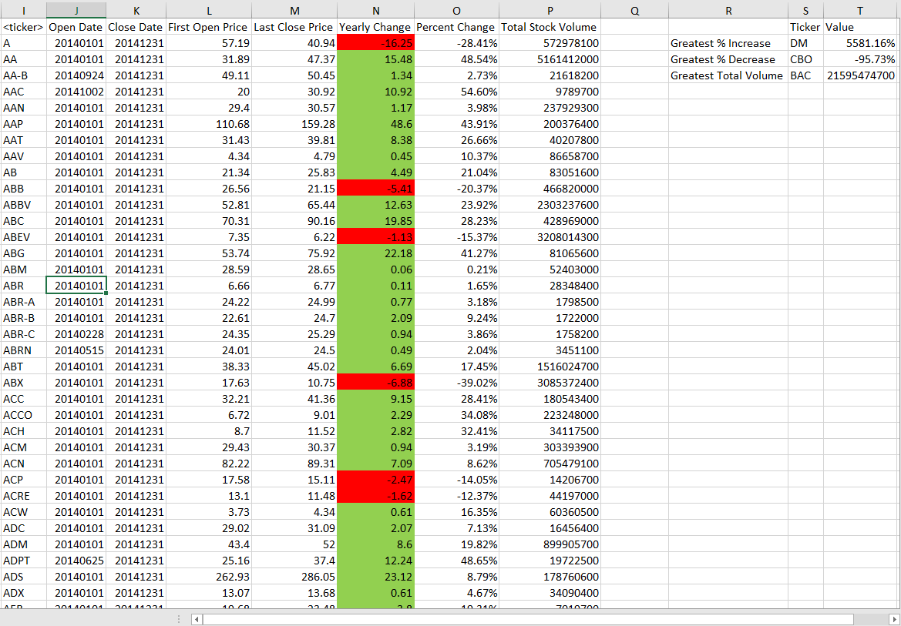

# Stock Market Data Analysis

## Introduction

This VB Script analyzes the stock market data provided in an Excel worksheet. The data in the excel should be in following predefined format for the script to work correctly.

---

## Usage

To use this script -
* Open the Excel file with data in predefined format
* Open Visual Basic window from the Developer Tab
* Click on File menu and select Import File Option
* Browse to the VB Script and select it to import into your excel
* Run Stock Report macro
* Each worksheet in the excel will be updated with various Metrics related to each Stock Ticker as per Screehsot below

